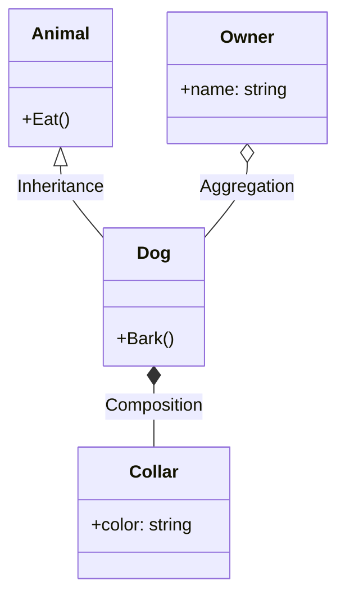
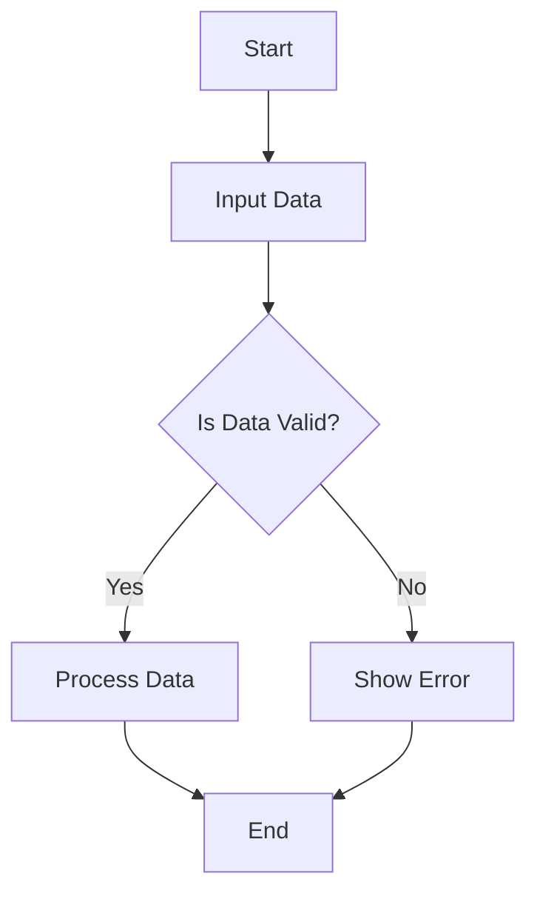
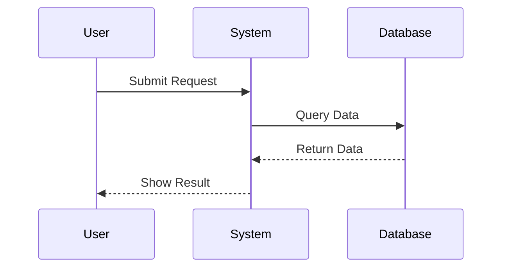

# UML Diagrams

This document covers the most important UML diagrams used in object-oriented design, including their standard notations, symbols, and annotated examples.

## Table of Contents
1. UML Diagram Annotations and Symbols
2. Class Diagram (with Annotations and Symbols)
3. Flow Diagram (with Annotations and Symbols)
4. Sequence Diagram (with Annotations and Symbols)

---

## 1. UML Diagram Annotations and Symbols

- **Class:** Rectangle with three compartments (name, attributes, operations)
- **Association:** Solid line between classes
- **Aggregation:** Hollow diamond at the aggregate (whole) end
- **Composition:** Filled diamond at the composite (whole) end
- **Inheritance (Generalization):** Solid line with a hollow triangle pointing to the parent
- **Dependency:** Dashed line with an open arrow
- **Multiplicity:** Numbers near association ends (e.g., 1, 0..*, 1..*)
- **Activation (Sequence):** Thin rectangle on lifeline
- **Message (Sequence):** Solid arrow between lifelines

---

## 2. Class Diagram (with Annotations and Symbols)

**Purpose:** Shows the static structure of a system, including classes, attributes, methods, and relationships.

**Key Symbols:**
- Rectangle: Class
- Line: Association
- Hollow diamond: Aggregation
- Filled diamond: Composition
- Hollow triangle: Inheritance

**Example:**

*Annotations:*
- `<|--` : Inheritance
- `o--` : Aggregation
- `*--` : Composition

---

## 3. Flow Diagram (with Annotations and Symbols)

**Purpose:** Illustrates the flow of control or data in a process or system.

**Key Symbols:**
- Rectangle: Process/Step
- Diamond: Decision
- Arrow: Flow direction
- Parallelogram: Input/Output

**Example:**

*Annotations:*
- `[]` : Process/Step
- `{}` : Decision
- `-->` : Flow

---

## 4. Sequence Diagram (with Annotations and Symbols)

**Purpose:** Shows how objects interact in a particular scenario of a use case, focusing on the order of messages.

**Key Symbols:**
- Vertical dashed line: Lifeline
- Solid arrow: Synchronous message
- Open arrow: Asynchronous message
- Rectangle on lifeline: Activation

**Example:**

*Annotations:*
- `->>` : Synchronous message
- `-->>` : Return message
- `participant` : Actor/object lifeline

---

> **References:**
> - UML Distilled by Martin Fowler
> - Head First Object-Oriented Analysis and Design
> - Official UML Specification
