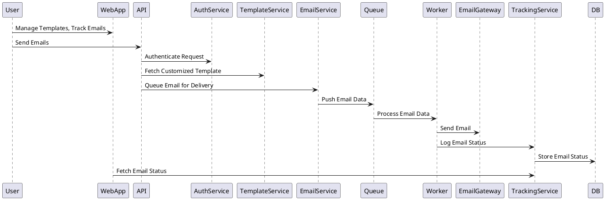
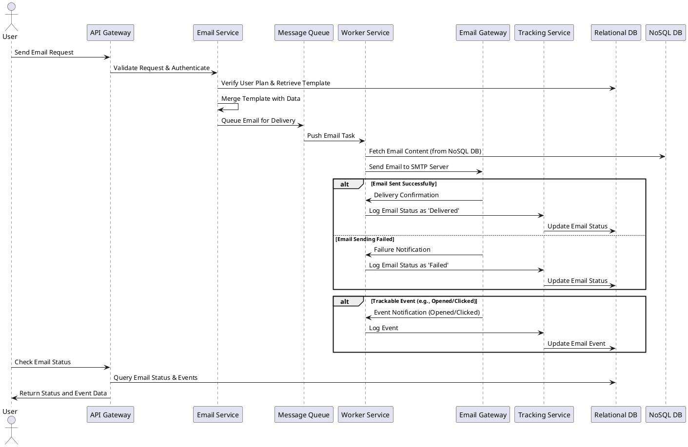
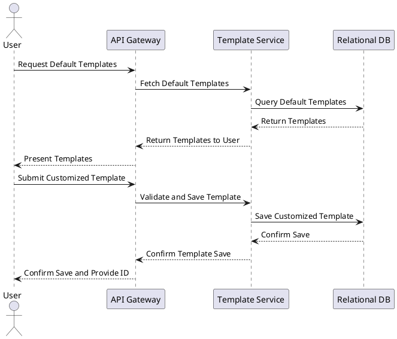
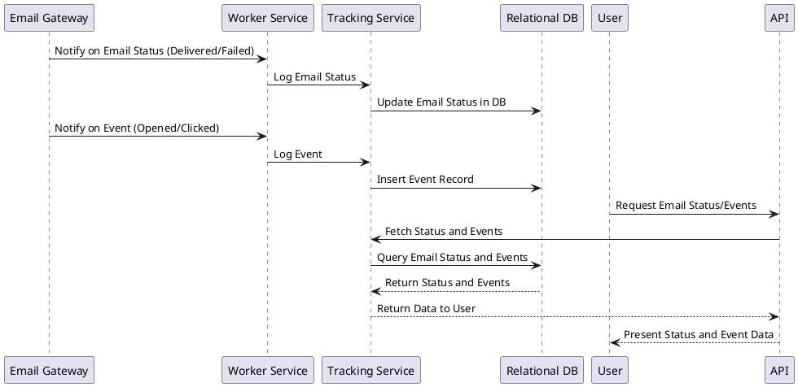

#  Enterprise Email Service Design

 

## Background

The purpose of this design is to create an enterprise-grade email service capable of sending HTML emails at scale. The service is targeted at large enterprises that require a robust, scalable solution for sending transactional and marketing emails. In addition to basic email delivery, the service will offer features like template customization and detailed email tracking, which are critical for businesses to manage and optimize their email communication strategies.

## Requirements

The system must fulfill the following requirements:

*Must-Have:*
- Ability to send HTML emails.
- Support for multiple pricing plans to accommodate varying levels of email volume and features.
- Template management system with default templates that users can customize.
- Email tracking to monitor the status of sent emails, including whether they were delivered, failed, opened, or clicked.
  
*Should-Have:*
- API access for integration with other enterprise systems.
- Detailed analytics dashboard for tracking email performance.

*Could-Have:*
- A/B testing for email campaigns.
- Multi-language support for email templates.

*Won't-Have:*
- Direct support for non-email communication channels (e.g., SMS, push notifications) in the initial version.


To start, I'll break down the **Method** section into several key areas:
1. **High-Level Architecture**
2. **Components and Their Responsibilities**
3. **Database Design**
4. **Email Sending Workflow**
5. **Template Management**
6. **Email Tracking Mechanism**

Let's begin with the high-level architecture.

### High-Level Architecture
The email service will consist of several core components, each responsible for a specific aspect of the service. These components will be designed to scale horizontally to handle large volumes of emails, with a focus on reliability and fault tolerance.


```
                +--------------------+
                |     API Gateway    |
                +---------+----------+
                          |
           +--------------+----------------+--------------+
           |              |                |              |
+----------v--+  +--------v-----+  +-------v--------+  +--v-----------+
|  Auth Service|  | Template      |  | Email Service  |  | Tracking     |
|              |  | Service       |  |                |  | Service      |
+--------------+  +---------------+  +----------------+  +--------------+
           |               |                  |               |
           |               |                  |               |
           |               |        +---------v---------+     |
           |               |        |      Queue       |     |
           |               |        +---------+-------+     |
           |               |                  |             |
           |               |           +------v------+
           |               |           |   Worker    |
           |               |           +------^------+
           |               |                  |
     +-----v-----+     +---v---+        +-----v------+
     |   CDN     |     |  DB   |        | Email      |
     |           |     |       |        | Gateway    |
     +-----------+     +-------+        +------------+

```




### Components Overview

1. **API Gateway**:
   - Exposes RESTful APIs for email sending, template management, and tracking.
   - Handles authentication and rate-limiting.

2. **Template Service**:
   - Manages default templates and allows users to customize them.
   - Stores template data and provides APIs for CRUD operations.

3. **Email Service**:
   - Responsible for processing and sending emails.
   - Interfaces with an internal message queue to ensure reliable email delivery.
   
4. **Worker Service**:
   - Consumes tasks from the queue and sends emails using the Email Gateway.
   - Ensures retries on failures and logs the status for tracking.

5. **Tracking Service**:
   - Monitors the status of sent emails (delivered, failed, opened, clicked).
   - Provides APIs to fetch email status and generates analytics reports.

6. **Email Gateway**:
   - Interfaces with third-party SMTP servers or proprietary email sending infrastructure.

### Database Design

 To design the database, we need to consider the specific requirements of each component and choose the appropriate type of database for storing and querying the data efficiently. Given the system's needs, we’ll use a combination of relational and non-relational databases to optimize for scalability, performance, and data integrity.

#### 1. **Relational Database (SQL)**
   - **Purpose**: Used for storing structured data where relationships between entities are critical, such as user information, email templates, and tracking data. A relational database like PostgreSQL or MySQL is well-suited for this purpose.

   
   
   - **Tables and Schemas**:

   ```plaintext
   Table Users {
  id int [pk, increment] // Primary key
  name varchar
  email varchar [unique]
  password_hash varchar
  plan_id int [ref: > Plans.id] // Foreign key to Plans
  created_at timestamp
  updated_at timestamp
}

Table Plans {
  id int [pk, increment] // Primary key
  name varchar
  email_limit int
  features json // Stores plan-specific features in JSON
  price decimal
  created_at timestamp
  updated_at timestamp
}

Table Templates {
  id int [pk, increment] // Primary key
  user_id int [ref: > Users.id] // Foreign key to Users
  name varchar
  content text // Stores HTML or plain text content
  created_at timestamp
  updated_at timestamp
}

Table Emails {
  id int [pk, increment] // Primary key
  user_id int [ref: > Users.id] // Foreign key to Users
  template_id int [ref: - Templates.id] // Foreign key to Templates (Nullable)
  recipient_email varchar
  subject varchar
  status varchar [note: 'queued, sent, failed, delivered, opened, clicked']
  created_at timestamp
  updated_at timestamp
}

Table EmailEvents {
  id int [pk, increment] // Primary key
  email_id int [ref: > Emails.id] // Foreign key to Emails
  event_type varchar [note: 'delivered, opened, clicked']
  timestamp timestamp
}
   ```

#### 2. **Non-Relational Database (NoSQL)**
   - **Purpose**: Used for storing unstructured or semi-structured data, such as email content, logs, and analytics data. A NoSQL database like MongoDB or DynamoDB is suitable for these use cases due to its ability to scale horizontally and handle large volumes of data.
   
   - **Collections and Documents**:

   ```plaintext
   - EmailContents
     - email_id (Indexed)
     - content (HTML/Text)
     - attachments (Array of Objects with metadata)
     - headers (JSON)

   - EmailLogs
     - email_id (Indexed)
     - log_entries (Array of JSON objects)
     - created_at
     - updated_at
   ```

### Database Integration

- **User and Template Management**: These will primarily interact with the SQL database to manage user information, pricing plans, and email templates.
- **Email Sending and Tracking**: The `Emails` table will store the basic metadata, while the `EmailEvents` table logs the detailed status changes. 
- **Email Content and Logs**: The actual content of the emails and any detailed logs will be stored in the NoSQL database for efficient storage and retrieval, especially given the potentially large size of email content and logs.

## Email Sending Workflow

To design the **Email Sending Workflow**, we need to outline the process that occurs from the moment a user triggers an email to the point where the email is either delivered, failed, or tracked. This workflow involves multiple components, including the API Gateway, Email Service, Message Queue, Worker Service, and Tracking Service.

### Email Sending Workflow Diagram


Here's a diagram using PlantUML that illustrates the email sending workflow:



### Explanation of the Workflow

1. **User Initiates Email**: The user sends a request to the API Gateway, providing details like the recipient's email, subject, and data for template merging.

2. **API Gateway Validates and Authenticates**: The API Gateway authenticates the user and validates the request (e.g., ensuring the user has sufficient quota based on their plan).

3. **Email Service Prepares the Email**:
   - The Email Service checks the user's plan and retrieves the appropriate template from the database.
   - It merges the template with the provided data (e.g., personalizing the email with the recipient's name).
   - The email is then queued for delivery in a message queue like RabbitMQ or AWS SQS.

4. **Worker Service Processes the Email**:
   - The Worker Service pulls the email task from the queue.
   - It retrieves the actual content of the email from the NoSQL database (which stores the HTML content, attachments, etc.).
   - The Worker Service sends the email via the Email Gateway, which interfaces with an SMTP server or third-party email provider.

5. **Tracking and Status Updates**:
   - If the email is sent successfully, the Email Gateway notifies the Worker Service, which logs the status as 'Delivered' in the Tracking Service. The Tracking Service updates the status in the relational database.
   - If the email fails to send, the status is logged as 'Failed.'
   - The system also tracks events like email opens or clicks, which are reported back to the Tracking Service and stored in the relational database.

6. **User Checks Status**:
   - The user can query the API Gateway to check the status of their sent emails.
   - The API retrieves the status and event data from the relational database and returns it to the user.

Let's proceed with detailing the **Template Management** and **Email Tracking Mechanism** as part of the design.

### 1. **Template Management**

The Template Management feature allows users to select from default email templates, customize them, and store these custom templates for later use. This process involves several steps, including retrieving templates, editing them, and saving the final versions.

#### **Template Management Workflow Diagram**




#### **Template Management Process**

1. **Fetching Default Templates**:
   - The user requests the list of default templates via the API Gateway.
   - The API Gateway forwards this request to the Template Service.
   - The Template Service queries the relational database to retrieve the available default templates.
   - The list of templates is returned to the user for selection.

2. **Customizing and Saving Templates**:
   - The user selects a template and customizes it as needed (e.g., modifying the HTML, adding dynamic fields).
   - The customized template is then submitted back to the API Gateway.
   - The API Gateway sends the template data to the Template Service, which validates the content (e.g., ensuring valid HTML).
   - The customized template is stored in the relational database under the user’s account.
   - The Template Service returns a confirmation along with the template ID for future reference.

### 2. **Email Tracking Mechanism**

The Email Tracking Mechanism monitors the status of sent emails and captures events like email opens, clicks, bounces, etc. This is critical for enterprises to understand the effectiveness of their email campaigns.

#### **Email Tracking Mechanism Workflow Diagram**




#### **Email Tracking Process**

1. **Logging Email Status**:
   - After an email is sent, the Email Gateway reports the result back to the Worker Service.
   - The Worker Service logs the status (e.g., 'Delivered', 'Failed') in the Tracking Service.
   - The Tracking Service updates the email’s status in the relational database.

2. **Tracking Events (e.g., Opened, Clicked)**:
   - When the recipient interacts with the email (opens, clicks a link), the Email Gateway captures these events.
   - The events are reported to the Worker Service, which logs them in the Tracking Service.
   - The Tracking Service then inserts these events into the `EmailEvents` table in the relational database for future reference.

3. **Fetching Email Status and Events**:
   - Users can request the status of their sent emails through the API Gateway.
   - The API Gateway queries the Tracking Service, which in turn retrieves the email status and event data from the database.
   - The data is returned to the user, allowing them to monitor the performance of their email campaigns.

 
