# Payment Processing 
To design a payment processing service that handles uploaded Excel files from blob storage, we'll break down the system into distinct components and outline a workflow that processes the file efficiently. The key objectives are to ensure that the system is cost-effective (minimizing blob storage read operations), reliable, and scalable.

Here's how we'll structure the design:

1. **Background**: The rationale and high-level description of the system.
2. **Requirements**: Functional and non-functional requirements.
3. **Method**: The architecture, components, and workflows involved in processing the payment data.
4. **Implementation**: The steps to implement the system.
5. **Milestones**: Key stages to track progress.

### 1. Background

The system is designed to process payment details from an Excel file that is uploaded to blob storage. Once uploaded, the file needs to be processed through several stages, including validation and payment completion. The file should only be read once from blob storage to minimize costs, and the processing tasks should be distributed across multiple services.

### 2. Requirements

#### Must-Have:
- Ability to upload Excel files to blob storage.
- Automated processing of the uploaded file through a series of services (e.g., validation, payment).
- Each service should be able to process data independently.
- Minimize the number of reads from blob storage.
- Error handling and logging for each stage of the process.

#### Should-Have:
- Notification system to inform stakeholders of the processing status.
- Scalability to handle large files and high volumes of payment data.

#### Could-Have:
- Retry mechanisms for failed payments.
- Support for different file formats (e.g., CSV).

#### Won’t-Have:
- Real-time payment processing (as this design is based on batch processing).

### 3. Method

#### High-Level Architecture

The architecture will consist of the following key components:

1. **Blob Storage**: Stores the uploaded Excel files.
2. **Orchestrator Service**: Coordinates the workflow, triggering subsequent services after the file is uploaded.
3. **File Processor Service**: Reads the file once from blob storage, splits the data into manageable chunks, and passes these chunks to other services for processing.
4. **Validation Service**: Validates customer and payment information.
5. **Payment Service**: Completes the payment for each validated entry.
6. **Database**: Stores processing results, logs, and metadata about the payments.
7. **Notification Service**: Sends out notifications about the processing status (optional).

```plantuml
@startuml
actor User

rectangle "Blob Storage" as BlobStorage
rectangle "Orchestrator Service" as Orchestrator
rectangle "File Processor Service" as FileProcessor
rectangle "Validation Service" as Validator
rectangle "Payment Service" as Payment
rectangle "Database" as DB
rectangle "Notification Service" as Notification

User -> BlobStorage: Upload Excel File
BlobStorage -> Orchestrator: Trigger on File Upload

Orchestrator -> FileProcessor: Start File Processing
FileProcessor -> BlobStorage: Read File Once
FileProcessor -> FileProcessor: Split Data into Chunks
FileProcessor -> Validator: Send Chunk for Validation

Validator -> Validator: Validate Data
Validator -> Payment: Send Validated Data for Payment
Validator -> DB: Log Validation Results

Payment -> Payment: Complete Payment
Payment -> DB: Log Payment Results

Orchestrator -> Notification: Send Processing Status (optional)
@enduml
```

#### Workflow Steps

1. **File Upload and Trigger**:
   - The user uploads the Excel file to the blob storage.
   - The blob storage triggers the Orchestrator Service upon file upload.

2. **File Processing**:
   - The Orchestrator Service instructs the File Processor Service to begin processing.
   - The File Processor Service reads the file from blob storage (only once) and splits the file into smaller chunks for easier processing.

3. **Validation**:
   - Each chunk of data is sent to the Validation Service.
   - The Validation Service checks each record for correctness (e.g., valid customer information, correct payment details).
   - Invalid records are logged, and valid records are sent to the Payment Service.

4. **Payment Completion**:
   - The Payment Service attempts to process the payment for each validated record.
   - Payment results (success or failure) are logged in the database.

5. **Logging and Notification**:
   - The system logs all validation and payment results in a central database for auditing and reporting.
   - Optionally, the Notification Service informs stakeholders of the process’s status (e.g., completion, errors).

### 4. Implementation

#### Technologies and Tools

- **Blob Storage**: Azure Blob Storage or AWS S3.
- **Orchestrator Service**: Could be implemented using a serverless function like Azure Functions, AWS Lambda, or a microservice with a message broker (e.g., Kafka, RabbitMQ).
- **File Processor Service**: Implemented using a microservice or serverless function that handles file reading and chunking.
- **Validation and Payment Services**: Microservices that process each chunk, possibly using frameworks like Spring Boot, Express.js, etc.
- **Database**: A relational database like PostgreSQL for storing logs and results.
- **Notification Service**: Optional service using email, SMS, or messaging platforms.

#### Implementation Steps

1. **Set Up Blob Storage**:
   - Create a blob storage container to store uploaded files.
   - Set up triggers to notify the Orchestrator Service when a file is uploaded.

2. **Develop Orchestrator Service**:
   - Implement logic to trigger the file processing workflow.
   - Use serverless functions or microservices to handle orchestration.

3. **Develop File Processor Service**:
   - Implement the logic to read the Excel file once and split it into manageable chunks.
   - Pass these chunks to the Validation Service for further processing.

4. **Develop Validation and Payment Services**:
   - Implement validation rules to ensure the integrity of the data.
   - Develop payment logic to interact with a payment gateway or service.

5. **Set Up Database and Logging**:
   - Create database schemas to store validation and payment logs.
   - Ensure all services log their actions for traceability.

6. **Develop Notification Service (Optional)**:
   - Implement notifications based on the status of file processing.

7. **Testing and Deployment**:
   - Test the system with sample files to ensure correct operation.
   - Deploy the services and set up monitoring.

 